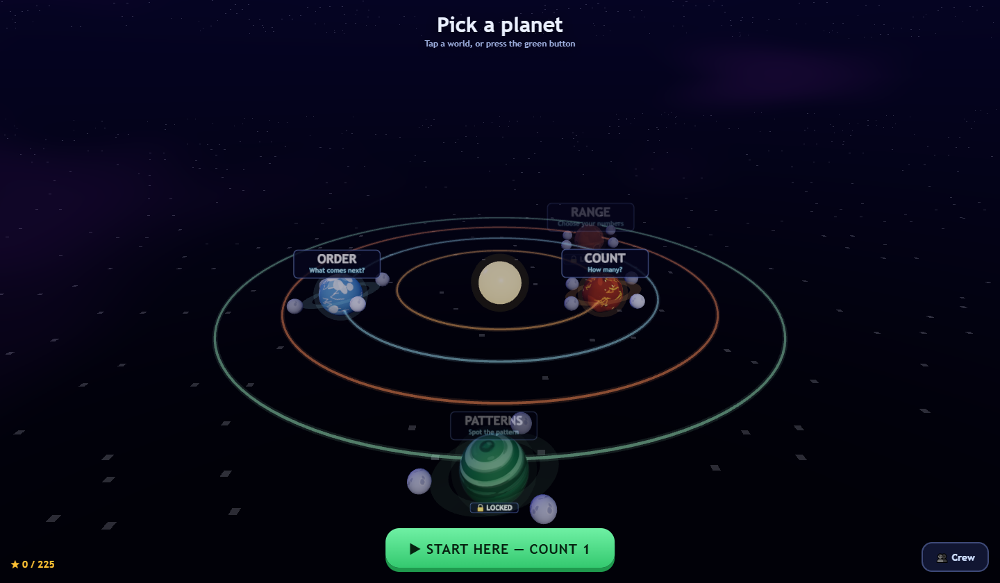
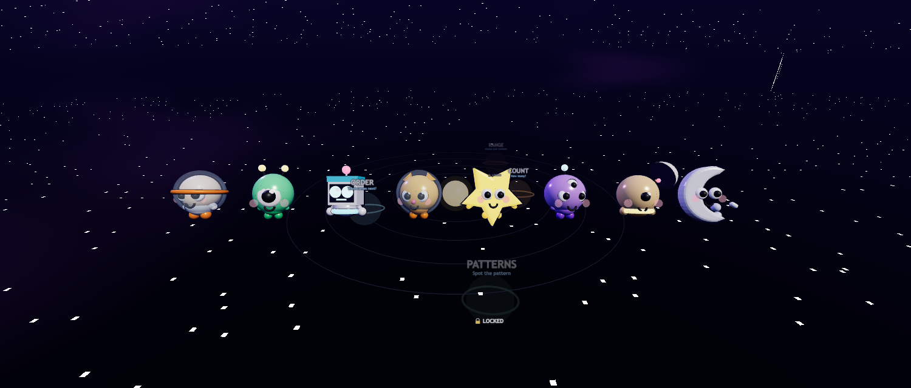
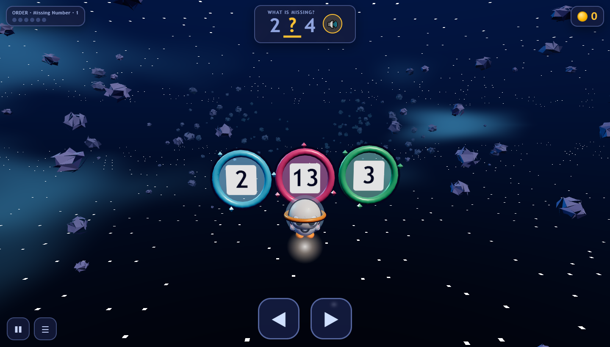
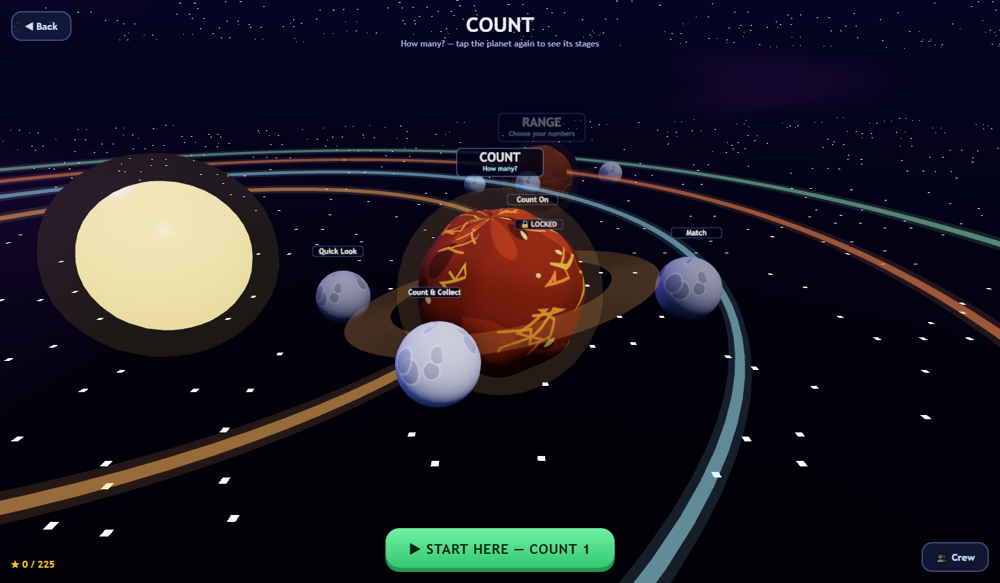
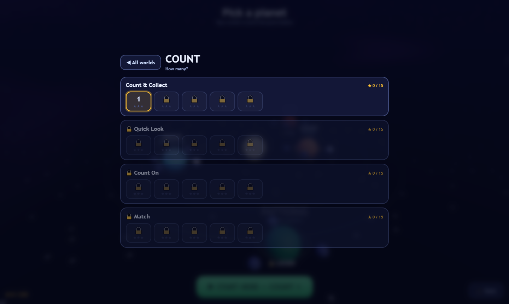

# KOCKAA Count Quest

A single-file 3D counting game for children. A cartoon crew flies through space
collecting gems, flying through numbered gates, and dropping markers on a number
line. Everything is generated in code — no models, textures, images, fonts or
audio files. One HTML file, no build step.



| | |
|---|---|
|  |  |
|  |  |

## Run it

```bash
python -m http.server 8795
```

Then open `http://localhost:8795`. Three.js loads from a CDN via importmap, so the
machine needs to be online the first time. **Turn the sound on** — the game speaks
every number.

## Four worlds ▸ moons ▸ stages

Tap a planet to fly to it, tap it again to open its stages. Stages unlock in order
and the next one to play is ringed in gold. The green **START HERE** button jumps
straight to it.

| Planet | Moons | What it teaches |
|---|---|---|
| 🔥 **COUNT** | Count & Collect · Quick Look · Count On · Match | One-to-one correspondence and cardinality — the game counts aloud with the child, then asks *how many* |
| ❄️ **ORDER** | What's Next · Missing Number · Before & Between · Backwards | The number sequence, including counting backwards |
| 🪨 **RANGE** | Sequence · Number Line · Nearest Ten · Big Jumps | Pick a range from 0–20 up to 1000–5000, or set your own |
| 🌿 **PATTERNS** | Skip Counting · Bigger or Smaller · Make Ten | Skip counting, comparison, number bonds |

## The crew

Eight characters, unlocked by achievements, cosmetic only — they never change
difficulty. ASTRO (starter) · BLIP · BOLT · COMET · NOVA · PIP · RUSTY · LUNA.

## Design rules that must not be broken

- **No way to fail.** No timer, no obstacles, no lives, no game over.
- **Every wrong answer teaches.** The correct gate lights green and is spoken, and
  where a quantity is involved it is rebuilt as a ten-frame — 14 becomes a full
  frame plus four.
- **Questions are weighted, never uniform random.** Teen numbers (11–19) are
  over-sampled and decade boundaries are targeted, because that is where children
  actually fail. Wrong options include the realistic confusion — 41 offered
  against 14 — rather than numbers no child would mix up.
- **Mastery skipping.** Once a size is answered correctly three times running it
  stops appearing. The game must not drill what is already known.
- **Prompts are short and finish before the gates arrive.** Gates spawn at
  `spacing + speed × SPEAK_LEAD`, and the gap between rounds waits for
  `speechSynthesis.speaking` to clear, capped so a stuck voice cannot stall play.
- **Speech is English only** and never falls back to a non-English system voice.
- **Every stage gives at least 1.7 s to decide**, asserted at startup.

## Things learned the hard way

- **A stage used to play exactly one round.** The gate-animation branch returned
  early while resolving, so the resolve → gap → next-round handler was never
  reached.
- **Collectibles must arrive in same-lane runs.** Scattered at random, sweeping up
  the whole set is impossible, which makes the count wrong through no fault of
  the child.
- **Outlines must match a mesh's final scale.** Bodies are squashed after the
  outline shell is made; a uniform shell on a squashed body reads as a thick dark
  halo, which is what made the pale characters look muddy.
- **Dark characters on a dark sky need light colours, not just an outline.**
- **Sprite labels need `sizeAttenuation: false`.** Otherwise they fill the screen
  the moment the camera flies close to a planet.
- **Ring gates must be narrower than the lane spacing** or they overlap.
- **Gate numbers use an unlit material.** A `MeshStandardMaterial` let the dark
  scene lighting dull the digits until they were unreadable.

## Tuning

Everything tunable is in the `CFG` object and the `PLANETS` / `THEMES` tables at
the top of the module — speeds, spacings, set sizes, coin values, star
thresholds, the Quick Look hold, the hidden assist, camera distances and the
quality presets.

## Verification

`final.mjs` drives the game in headless Chrome and asserts question generation
(no duplicate options, exactly one correct answer, teen over-sampling), the
reaction-time floor across all 75 stages, gameplay resolution, the number line,
audio signal levels, and HUD layout at desktop, tablet, phone portrait and phone
landscape.

```bash
npm install
npm run verify
```

---

Developed by **[KOCKAA](https://www.etsy.com/shop/KOCKAA)**
